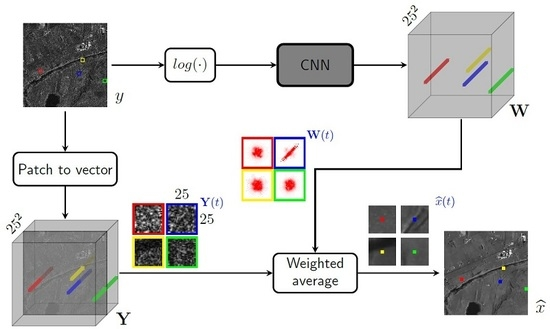

We propose a new method for SAR image despeckling, which performs nonlocal filtering with a deep learning engine. Nonlocal filtering has proven very effective for SAR despeckling. The key idea is to exploit image self-similarities to estimate the hidden signal. In its simplest form, pixel-wise nonlocal means, the target pixel is estimated through a weighted average of neighbors, with weights chosen on the basis of a patch-wise measure of similarity. Here, we keep the very same structure of plain nonlocal means, to ensure interpretability of results, but use a convolutional neural network to assign weights to estimators. Suitable nonlocal layers are used in the network to take into account information in a large analysis window. Experiments on both simulated and real-world SAR images show that the proposed method exhibits state-of-the-art performance. In addition, the comparison of weights generated by conventional and deep learning-based nonlocal means provides new insight into the potential and limits of nonlocal information for SAR despeckling

### News

*   2020-07-31: The code will be soon available.

### Bibtex

```js
@article{cnn_nlm_despeckling, 
author={D. Cozzolino and L. Verdoliva and G. Scarpa and G. Poggi}, 
journal={Remote Sensing}, 
title={Nonlocal CNN SAR Image Despeckling}, 
year={2020},
volume={12},
number={6},
doi={10.3390/rs12061006}
} 
```


